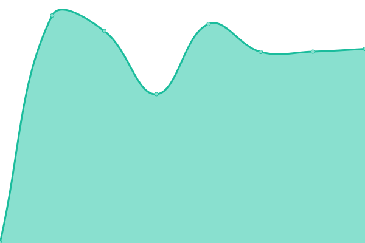
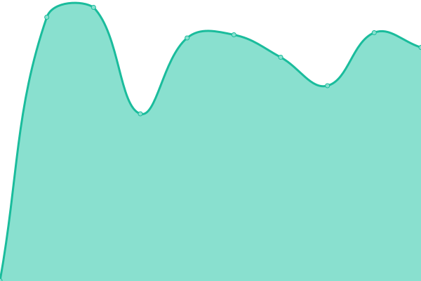
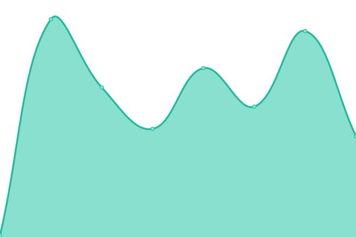
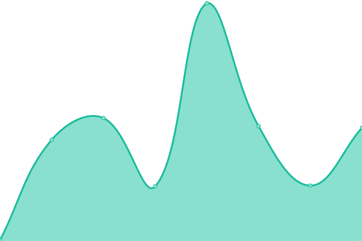

# 

This repository contains the open-source uptime monitor and status page for [On Early](https://OnEarly.github.io/status), powered by [Upptime](https://github.com/upptime/upptime).

With [Upptime](https://upptime.js.org), you can get your own unlimited and free uptime monitor and status page, powered entirely by a GitHub repository. We use [Issues](https://github.com/OnEarly/status/issues) as incident reports, [Actions](https://github.com/OnEarly/status/actions) as uptime monitors, and [Pages](https://OnEarly.github.io/status) for the status page.

<!--start: status pages-->
<!-- This summary is generated by Upptime (https://github.com/upptime/upptime) -->
<!-- Do not edit this manually, your changes will be overwritten -->
<!-- prettier-ignore -->
| URL | Status | History | Response Time | Uptime |
| --- | ------ | ------- | ------------- | ------ |
|  [OnEarly App](https://onearly.com) | 🟩 Up | [on-early-app.yml](https://github.com/OnEarly/status/commits/HEAD/history/on-early-app.yml) | 

 677ms
     
 | 

<a href="https://status.onearly.com/history/on-early-app">100.00%</a>
    

|  [OnEarly API AU](https://api.au.onearly.com/health) | 🟩 Up | [on-early-api-au.yml](https://github.com/OnEarly/status/commits/HEAD/history/on-early-api-au.yml) | 

 651ms
     
 | 

<a href="https://status.onearly.com/history/on-early-api-au">100.00%</a>
    

|  [OnEarly Docs](https://docs.onearly.com) | 🟩 Up | [on-early-docs.yml](https://github.com/OnEarly/status/commits/HEAD/history/on-early-docs.yml) | 

 111ms
     
 | 

<a href="https://status.onearly.com/history/on-early-docs">100.00%</a>
    

|  [OnEarly App Staging](https://staging.onearly.com) | 🟥 Down | [on-early-app-staging.yml](https://github.com/OnEarly/status/commits/HEAD/history/on-early-app-staging.yml) | 

 147ms
     
 | 

<a href="https://status.onearly.com/history/on-early-app-staging">0.00%</a>
    

|  [OnEarly API AU Staging](https://api.au.staging.onearly.com/health) | 🟩 Up | [on-early-api-au-staging.yml](https://github.com/OnEarly/status/commits/HEAD/history/on-early-api-au-staging.yml) | 

 644ms
     
 | 

<a href="https://status.onearly.com/history/on-early-api-au-staging">99.65%</a>
    

<!--end: status pages-->

[**Visit our status website →**](https://OnEarly.github.io/status)
